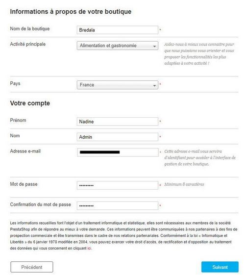
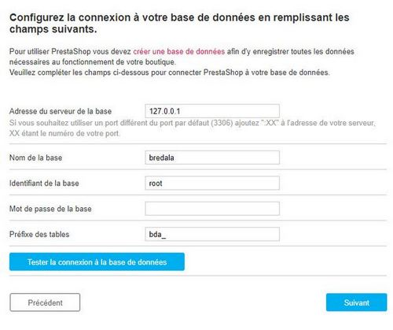
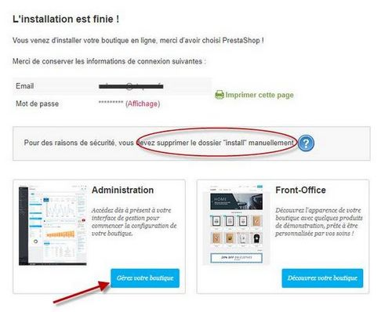

# Initiation Prestashop

## Préparation des ressources

Avant de s'attaquer à l'installation, il convient de rassembler les informations essentiels du site :

- Titre du site
- Description
- Logo
- Favicon
- Images du carousel au format 1110 * 340 pixels
- Bannière, descriptiftextuel du site, etc.

Pour le catalogue, il est nécessaire de préparer la liste des catégories et sous-catégories.<br/>
Ainsi que la liste des produits, par sous-catégorie.

## Installation

Télécharger Prestashop sur https://www.prestashop.com/fr <br/>
Dézipper sur le serveur Apache. <br/>
Créer une base Mysql et conserver les infos de connexion.

Se connecter au site pour la configuration ...

## Configuration

Renseigner toutes les infos demandés

Le compte est celui du super administrateur du site :



Rensigner les infos de connexion à la base. <br/>
Il est conseillé d'indiquer un préfixe spécifique au lieu du ***ps_*** trop connu (pour compliquer la vie des script malveillants)



Si tout s'est bien passé, l'installation est terminée.<br/>
**Supprimer le dossier /install** du site et accéder au back-office d'administration pour la suite de la configuration :



On retrouve toutes ces informations dans :<br/>
Menu CONFIGURER - Paramètres avancés - Informations

<!-- Si vous avez des messages d'erreurs, voir : [configuration Apache sur Linux](config_linux.md) -->

<hr/>

## Mise à jour des plugins

Menu PERSONNALISER - Modules - Module Manager : dans le dossier *Mises à jour*, tout mettre à jour.

<hr/>

## Gestion de l'apparence

### Logos

Menu PERSONNALISER - Apparence - Thème et logo : remplacer les logos et le favicon

### Carrousel

Menu PERSONNALISER - Modules - Module Manager : rechercher Carrousel<br/>
Remplacer les diapositives.

### Bannière

Pour gérer les positions des éléments de la page d'accueil : Menu PERSONNALISER - Apparence - Positions <br/>
Rechercher le point d'accroche "displayHome". <br/>
Remonter la bannière au-dessus des produits.<br/>
Module Manager : rechercher "Bannière" et changer l'image.

### Bloc de texte

Module Manager : rechercher "texte" et changer le texte.

### Autres blocs ?

Pour greffer d'autres modules : retourner dans Apparence - Positions et cliquer sur "Greffer un module".

Par exemple : greffer le module "Réassurance" sur le *hook* "displayFooterBefore" et le mettre en 1ère position. <br/>
Configurer le module dans le Module Manager (Content et Display)

*Testez, essayez, tentez ... pour vous approprier les modules !*

### Style personnalisé : custom.css

Trouver le fichier *custom.css* dansle dossier du thème : ce fichier permet de surcharger le style sans risque d'écrasement lors de la mise à jour du thème.

Par exemple :

```css
    .blockreassurance {
        border-bottom: 1px gray solid;
        margin-bottom: 40px;
        padding-bottom: 10px;
    }
```

<hr/>

## Préparation de la mise en ligne des produits

### Nettoyage du jeu de test de Prestashop

Dans le catalogue de module, rechercher "cleaner" et installer le module **PrestaShop Cleaner**.

Dans la configuration du module :

### Création des catégories

Menu VENDRE - Catalogue - Catégories, créer une catégorie :

- titre et description
- Balise titre : très important pour le référencement (pensez mots-clés)

Sélectionner un catégorie et ajouter une sous-catégorie ...

### Gestion du menu

Module Manager : chercher "menu" pour configurer le menu principal.

Ajouter les catégories de 1er niveau créées.

Réglez les liens du Carrousel aussi ...

### Création des attributs et caractéristiques

Créer une caractéristique et la remplir d'une liste de valeur

### Création de produit

Créer un nouveau produit manuellement :

- nom, photo et description
- quantité (obligatoire !)
- prix avec règle de taxe
- caractéristique
- catégories associées et catégorie principale (la plus petite dans l'arborescence)

Configurer les autres onglets ...

### Importer une liste de produits

Menu CONFIGURER - Paramètres avancés - Importer

Télécharger le fichier d'exemple de produits et le modifier avec les produits ...

Importer !

<br/>
<hr/>

## A vous de jouer

Installez, configurez et mettez en ligne vos produits ...
