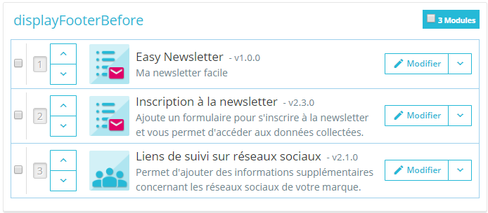

# Création d'un plugin Newsletter pour Prestashop

Il s'agit de créer un plugin qui propose aux visiteurs de s’inscrire sur le site en fournissant leur adresse email afin de recevoir une newsletter. <br/>
Ce TD est tiré de l'excellent guide complet : [Guide complet : créer un module dans Prestashop 1.7](https://newslang.ch/blog/guide-complet-creer-module-prestashop-1-7)

<hr/>

## Création du plugin de base

Utiliser le générateur de module de Prestashop : https://validator.prestashop.com/generator


Télécharger le zip du module et l'installer dans le catalogue de module, via le bouton ***Installer un module***

<hr/>

## Configuration du plugin généré

Le fichier **easy_newsletter.php** contient la classe de base du plugin.<br/>
Son **constructeur** contient les paramètres du plugin renseignés dans le générateur.

### La table en base de données

Les méthodes **install** et **uninstall** contient l'enregistrement du plugin dansles *hooks* et l'inclusion des fichiers SQL de création et suppression des objets en base de données. <br/>
Modifier le fichier **sql/install.php** pour ajouter le champ email dans le base : ```  `email` varchar(255) NOT NULL ``` <br/>
Modifier le fichier **sql/uninstall.php** pour supprimer la table dans le base : ```  $sql[] = 'DROP TABLE `' . _DB_PREFIX_ . 'easy_newsletter`;'; ``` <br/>
Réinitialiser le module dans le catalogue de module pour répercuter le changemernt en base :


<br/>

### La page d'administration du module

La méthode **getContent** sert le rendu de la page d'administration du module.<br/>
On voit que si le formulaire est soumis, laméthode **postProcess** est appelée pour sauvegarder les paramètres de configuration.

La description du module se trouve dans le fichier *smarty* : ```` views/templates/admin/configure.tpl ```` <br/>
Modifier ce fichier :

```PHP
    <div class="panel">
        <h3><i class="icon icon-credit-card"></i> {l s='Easy Newsletter' mod='easy_newsletter'}</h3>
        <p>
            Module de génération facile de la newsletter à envoyer à tous les emails enregistrés.
        </p>
    </div>
```


<br/>
La méthode **getConfigFormValues** contient la liste des options générées. Ces options sont enregistrées dans la table Prestashop destinée à cet effet : ps_configuration.

Enfin, la méthode **getConfigForm** contient la configuration du formulaire de saisie des options.

Modifier ces méthodes afin de traiter 3 paramètres : 

- l'email de l'expéditeur dela newsletter
- l'objet de l'email
- le message contenant le corps del'email.

```PHP
    protected function getConfigFormValues()
    {
        return array(
            'EASY_NEWSLETTER_SENDER_EMAIL' => Configuration::get('EASY_NEWSLETTER_SENDER_EMAIL', ''),
            'EASY_NEWSLETTER_OBJECT' => Configuration::get('EASY_NEWSLETTER_OBJECT', ''),
            'EASY_NEWSLETTER_BODY' => Configuration::get('EASY_NEWSLETTER_BODY', ''),
        );
    }
```

```PHP
    protected function getConfigForm()
    {
        return array(
            'form' => array(
                'legend' => array(
                'title' => $this->l('Paramètres de la newsletter'),
                'icon' => 'icon-cogs',
                ),
                'input' => array(
                    array(
                        'col' => 3,
                        'type' => 'text',
                        'prefix' => '<i class="icon icon-envelope"></i>',
                        'desc' => $this->l("Rensigner l'email de l'expéditeur"),
                        'name' => 'EASY_NEWSLETTER_SENDER_EMAIL',
                        'label' => $this->l('Email'),
                    ),
                    array(
                        'col' => 3,
                        'type' => 'text',
                        'prefix' => '<i class="icon icon-envelope"></i>',
                        'desc' => $this->l("Renseigner l'object du mail"),
                        'name' => 'EASY_NEWSLETTER_OBJECT',
                        'label' => $this->l('Sujet'),
                    ),
                    array(
                        'col' => 3,
                        'type' => 'textarea',
                        'prefix' => '<i class="icon icon-envelope"></i>',
                        'desc' => $this->l("Renseigner le corsps message"),
                        'name' => 'EASY_NEWSLETTER_BODY',
                        'label' => $this->l('Message'),
                    ),
                ),
                'submit' => array(
                    'title' => $this->l('Save'),
                ),
            ),
        );
    }
```

Sans oublier les méthodes install et uninstall :

```PHP
    public function install()
    {        
        Configuration::updateValue('EASY_NEWSLETTER_LIVE_MODE', false); // Supprimer cette ligne !!
        // ...
    }

    public function uninstall()
    {
        Configuration::deleteByName('EASY_NEWSLETTER_SENDER_EMAIL');
        Configuration::deleteByName('EASY_NEWSLETTER_OBJECT');
        Configuration::deleteByName('EASY_NEWSLETTER_BODY');
        // ...
    }
```


<br/>
<hr/>

## La position du module (et son logo)

Il reste à reconfigurer la position de la newsletter dans le **displayFooterBefore** au lieu du **displayFooter**. <br/>
Les hooks **header** et **backOfficeHeader** sont utiles pour ajouter les fichiers CSS ou JS : on les laisse !<br/>
Modifier la méthode **install** et, à nouveau, réinitialiser le module pour la prise en compte de la modif :

```PHP
    public function install()
    {
        include(dirname(__FILE__).'/sql/install.php');

        return parent::install() &&
            $this->registerHook('header') &&
            $this->registerHook('backOfficeHeader') &&
            $this->registerHook('displayFooterBefore');
    }
```

Dans le menu Apparence - Positions, le module doit apparaitre maintenant dans le bon **hook** :



<br/>
Pour avoir l'icône, il suffit de créer un fichier **logo.png** à la racine du dossier module. <br/>
Ici par exemple, l'image de la Newsletter par défault de Prestashop a été copiée ...
<br/>
<br/>
<hr/>

## Afficher du contenu sur la boutique (coté front)

Le paramétrage de base est terminé, il faut ajouter le formulaire de saisie sur la boutique afin d'enregistrer les emails des utilisateurs.

Le module est positionné sur le hook **displayFooterBefore**, il faut donc implémenter la méthode de ce nom : **hookDisplayFooterBefore**

```PHP
    /**
     * Ajout du formulaire sur la boutique
     */
    public function hookDisplayFooterBefore($params)
    {
        // Ajout des variables à passer à la vue 
        $this->context->smarty->assign([
            'easy_page_name' => $this->displayName,
            'esay_page_link' => $this->context->link->getModuleLink('easy_newsletter', 'display')
        ]);
    
        // Rendu de la vue, à mettre dans le dossier templates/hook
        return $this->display(__FILE__, 'easy_newsletter.tpl');
    }
```

Les templates doivent se trouver dans le dossier /views/templates du module, sous l’un des 3 dossiers suivant :

- /front : templates liés à la boutique
- /admin : templates liés au back office
- /hook : templates liés à un hook défini (indépendant du front ou back office)

Les templates sont des fichiers **tpl** basés sur le moter de rendu **smarty**. <br/>
Documentation smarty : https://www.smarty.net/docs/en/index.tpl <br/>
Variables globales Prestashop : https://catalogo-onlinersi.net/en/content/33-prestashop-17-global-variables

Dans notre cas, créer le fichier suivant : **/views/templates/hook/easy_newsletter.tpl** :

```PHP
    <!-- Block easy_newsletter -->
    <a name="easy_newsletter_block"></a>
    <div id="easy_newsletter_block_home">

        <h2>{$easy_page_name}</h2>

        <form action="#easy_newsletter_block" method="post">
            <div class="easy_newsletter_form">
                <input name="email" type="email" value="" placeholder="Votre adresse e-mail" required>
                <input class="btn btn-primary float-xs-right hidden-xs-down" name="submitNewsletter" type="submit" value="S’abonner">
                <input class="btn btn-primary float-xs-right hidden-sm-up" name="submitNewsletter" type="submit" value="ok">
            </div>
        </form>

        <p>Vous pouvez vous désinscrire à tout moment. Vous trouverez pour cela nos informations de contact dans les conditions d'utilisation du site.</p>
    </div>
    <!-- /Block easy_newsletter -->
```

et un peu de css dans **/views/css/front.css** :

```CSS
    #easy_newsletter_block_home {
        display: block;
        width:100%;
        padding: 40px;
    }

    #easy_newsletter_block_home h2 {
        text-align: center;
        text-transform: uppercase;
        margin-bottom: 20px;
    }

    .easy_newsletter_form {
        display: grid;
        width:60%;
        grid-template-columns: 1fr auto auto;
        margin:auto;
    }

    #easy_newsletter_block_home form input[type=email] {
        padding: 11px;
        width: 100%;
    }
    #easy_newsletter_block_home form input {
        height: 42px;
        box-shadow: none;
    }

    #easy_newsletter_block_home p {
        text-align: center;
        font-style: italic;
        margin-top:10px;
    }
```

Attention : ne pas hésiter à vider le cache si les modifications n'apparaissent pas sur le site !! Supprimer le dossier : **/var/cache**


<br/>
<hr/>

## Enregister l'email saisi dans le formulaire front

Prestashop fournit des **Tools** très pratique, pour tester si le formulaire a été soumis. <br/>
Si oui, il suffit de récupérer l'email et de l'inscrire en base de données, s'il est valide bien entendu !

Modifier la méthode **hookDisplayFooterBefore** :

```PHP
    public function hookDisplayFooterBefore($params)
    {
        //validation de la form ?
        $msg ="";
        if (Tools::isSubmit('submitNewsletter')) {
           
            if (empty($_POST['email']) || !Validate::isEmail($_POST['email'])) {
                $msg = "Erreur : l'email est invalide !";
            }
            else {
                $email = $_POST['email'];
                include(dirname(__FILE__).'/sql/registeremail.php');
                $msg = "Merci, votre email est enregistré !";
            }
        }

        // Ajout des variables à passer à la vue 
        $this->context->smarty->assign([
            'easy_page_name' => "Recevez notre lettre d'informations",
            'esay_page_link' => $this->context->link->getModuleLink('easy_newsletter', 'display'),
            'easy_message' => $msg,
        ]);
    
        // Rendu de la vue, à mettre dans le dossier templates/hook
        return $this->display(__FILE__, 'easy_newsletter.tpl');
    }
```

Et créer le fichier **/sql/registeremail.php** :

```PHP
    <?php
    $sql1 = "select 1 from ". _DB_PREFIX_ ."easy_newsletter where email = '" . pSQL($email) . "';";
    $sql2 = "INSERT INTO ". _DB_PREFIX_ ."easy_newsletter (email) values ('" . pSQL($email) . "');";
    if (Db::getInstance()->getValue($sql1) != 1) {
        Db::getInstance()->execute($sql2);
    }
```

Enfin, ajouter une zone pour afficher le message de retour dans le fichier **easy_newsletter.tpl** :

```PHP
    {if !empty($easy_message)}
        <p>{$easy_message}</p>
    {/if}
```

<hr/>

## Afficher la liste des emails inscrits dans le backoffice 

La classe **HelperForm** a été utilisé pour générer le formuaire de saisie des options du plugins.

La classe **HelperList** peut être utilisée pour afficher la liste ds emails saisis. <br/>
Ici la doc : http://doc.prestashop.com/display/PS16/Using+the+HelperList+class

Ajouter une nouvelle méthode **renderList** dans le fichier **easy_newsletter.php** :

```PHP
public function renderList()
    {
        $fields_list = array(
            'id_easy_newsletter' => array(
                'title' => $this->l('Id'),
                'search' => false,
            ),
            'email' => array(
                'title' => $this->l('Email'),
                'search' => true,
            ),
        );

        if (!Configuration::get('PS_MULTISHOP_FEATURE_ACTIVE')) {
            unset($fields_list['shop_name']);
        }
        $helper_list = new HelperList();
        $helper_list->module = $this;
        $helper_list->title = "Liste des emails enregistrés";
        $helper_list->shopLinkType = '';
        $helper_list->show_toolbar = true;
        $helper_list->simple_header = false;
        $helper_list->identifier = 'id_easy_newsletter';
        $helper_list->table = 'easy_newsletter';
        $helper_list->currentIndex = $this->context->link->getAdminLink('AdminModules', false).'&configure='.$this->name;
        $helper_list->token = Tools::getAdminTokenLite('AdminModules');
        $helper_list->actions = array('viewCustomer');
        $this->_helperlist = $helper_list;

        /* Retrieve list data */
        $sql = "select id_easy_newsletter, email from ". _DB_PREFIX_ ."easy_newsletter ";
        if(!empty($this->_searched_email))  $sql .= "where email like '%" . pSQL(pSQL($this->_searched_email)) . "%'";
        $emails = (Db::getInstance())->executeS($sql, true);

        $helper_list->listTotal = count($emails);
        return $helper_list->generateList($emails, $fields_list);
    }
```

L'objet **HelperList** est configuré avec les paramètres minimum, pour la table **easy_newsletter** du plugin.

Puis une requête est effectuée en base de données pour récupérer la liste des emails. <br/>
On teste une variable **_searched_email**, à créer, pour filtrer éventuellement la liste.

Puis le rendu html est généré et retourné : ce rendu doit être ajouté à notre rendu précéndent dans la méthode **getContent** :

```PHP
    public function getContent()
    {
        // ...

        $this->_html .= $this->renderForm(); // pour la saisie des options
        $this->_html .= $this->renderList(); // la liste des emails enregistrés
        return $this->_html;
    }
```

Reste à gérer la variable **_searched_email**, initialisée à null dans le constructeur et récupérée à la soumission du filtre de recherche de la liste :

```PHP
    public function __construct()
    {
        //pour la recherche d'email
        $this->_searched_email = null;

        // ...
    }

    // Méthode de rendu de la page d'administration complète
    public function getContent()
    {
        $this->_searched_email = null;

        // soumission des saisies des options
        if (((bool)Tools::isSubmit('submitEasy_newsletterModule')) == true) {
            $this->postProcess();
        }

        // soumission de la recherche dans le liste d'email
        elseif (Tools::isSubmit('submitFilter')) {
            $this->_searched_email = Tools::getValue('easy_newsletterFilter_email');
        }

        $this->context->smarty->assign('module_dir', $this->_path);
        $output = $this->context->smarty->fetch($this->local_path.'views/templates/admin/configure.tpl');

        $this->_html .= $this->renderForm(); // pour la saisie des options
        $this->_html .= $this->renderList(); // la liste des emails enregistrés
        return $this->_html;
    }
```


<hr/>

## Plugin complet

Recupérer le plugin ici : <a href="assets/easy_newsletter.zip" download>easy_newsletter.zip</a>