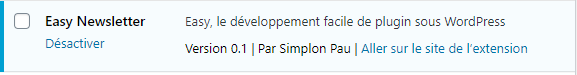
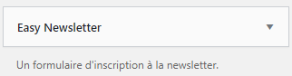
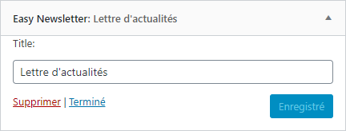
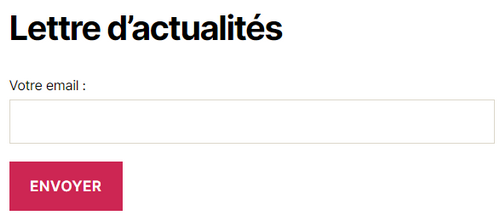
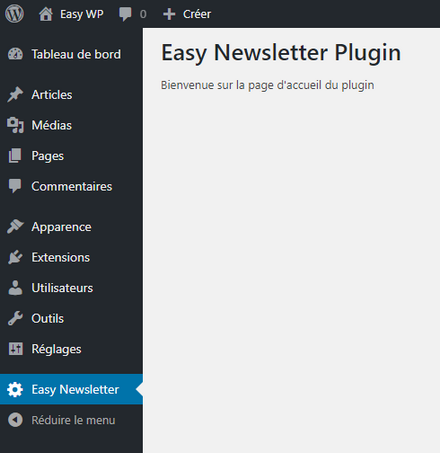
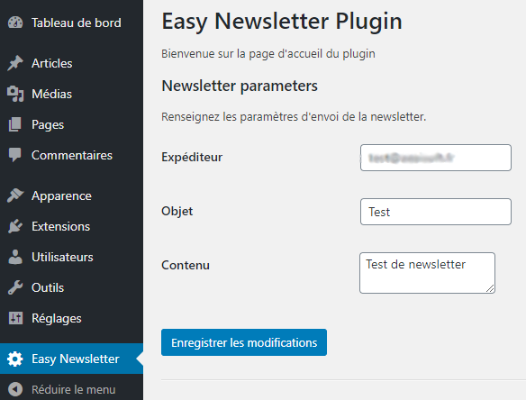
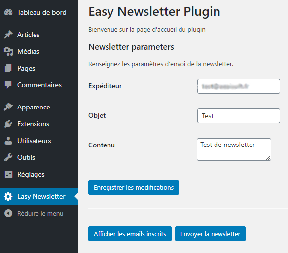

# Création d'un plugin Newsletter pour Wordpress

Il s'agit de créer un plugin qui propose aux visiteurs de s’inscrire sur le site en fournissant leur adresse email afin de recevoir une newsletter. <br/>
Ce TD est remis à jour d'après le cours OpenClassRooms : [Propulsez votre site avec Wordpress](https://openclassrooms.com/fr/courses/1891206-propulsez-votre-site-avec-wordpress)

Pour ce plugin d'exemple, très complet, il faut :

- créer un widget, affiché sur toutes les pages, dans le but de récupérer les adresses email
- ajouter une table supplémentaire dans la base de données afin de stocker la liste des adresses
- créer l’interface d’administration permettant à l’administrateur de définir le contenu de cet email, son objet, l’adresse email de l’expéditeur et un bouton pour déclencher l’envoi.

<hr/>

## Création de base du plugin

Les plugins doivent tous être situés dans le dossier wp-content/plugins par convention WordPress. <br/>
Créer un dossier : **easynewsletter**

Pour que le plugin soit reconnu par WordPress, il faut déclarer au moins son nom dans le fichier principal, c'est tout !<br/>
Il est recommandé d'ajouter quelques autres informations, comme son url, sa description, sa version, son auteur ...

Créer un fichier **easyplugin.php** :

````PHP
    <?php
    /*
    Plugin Name: Easy Newsletter
    Plugin URI: https://github.com/FabriqueNumeriquePau
    Description: Easy, le développement facile de plugin sous WordPress
    Version: 0.1
    Author: Simplon Pau
    License: GNU GPL2
    */
    class EasyPlugin
    {
        public function __construct()
        {
            //instancie la classe de base
            include_once plugin_dir_path( __FILE__ ).'/newsletter.php';
            new Newsletter();
        }
    }

    new EasyPlugin(); //chargement du plugin
````

et le fichier **newsletter.php**, contenant la classe de base du plugin :

````PHP
    <?php
    class Newsletter
    {
        public function __construct()
        {

        }
    }
````

Le plugin est maintenant présent dans les extensions :




<hr/>

## Création du widget

La documentation complète ici : https://codex.wordpress.org/Widgets_API

Créer le fichier **newsletterwidget.php** :

````PHP
    <?php
    class NewsletterWidget extends WP_Widget
    {

        // Surcharge obligatoire du constructer du widget : 
        // identificant : le nom de la classe 'Easy_newsletter'
        // name : le titre pour l’administration 'Easy Newsletter'
        // widget_options : une description pour la classe 
        public function __construct() {
            $widget_ops = array( 
                'classname' => 'NewsletterWidget',
                'description' => 'Un formulaire d\'inscription à la newsletter.',
            );
            parent::__construct( 'NewsletterWidget', 'Easy Newsletter', $widget_ops );
        }
            
        // Surcharge obligatoire du rendu du widget
        public function widget($args, $instance)
        {
            echo 'widget newsletter';
        }

        //Méthode de gestion des paramètre dans l'admin
        public function form( $instance ) {
        }

        //Méthode d'enregistrement des options
        public function update( $new_instance, $old_instance ) {
        }
    }
````

Le widget doit être enregistré dans la fonction widgets_init de WP. Ajouter dans **newsletter.php** :

````PHP
    <?php
    class Newsletter
    {
        public function __construct()
        {
            // inscription du widget
            include_once plugin_dir_path( __FILE__ ).'/newsletterwidget.php';
            add_action( 'widgets_init', function(){
                register_widget( 'NewsletterWidget' );
            });
        }
    }
````

Le widget est maintenant présent dans les Widgets (menu Apparence) :



Pour le voir sur le front, il faut l'ajouter dans une des zones.

<hr/>

## Ajout d'un paramètre *title* paramètre dans le widget

Ajouter le code suivant dans les méthodes **form** et **update** du widget (fichier **newsletterwidget.php**) :

````PHP
    // Méthode de gestion des paramètre dans l'admin
	// On gère les paramètres grâce à $instance
	public function form( $instance ) {
		$title = ! empty( $instance['title'] ) ? $instance['title'] :'';
		$id = esc_attr( $this->get_field_id( 'title' ) );
		$name = esc_attr( $this->get_field_name( 'title' ) );
		$label = esc_attr_e( 'Title:', 'text_domain' );
		$value = esc_attr( $title ); 
		echo "<p>",
			 "<label for='$id'>$label</label>",
			 "<input class='widefat' id='$id' name='$name' type='text' value='$value'>",
		     "</p>";
	}

	//Méthode d'enregistrement des options
	public function update( $new_instance, $old_instance ) {
		$instance['title'] = ( ! empty( $new_instance['title'] ) ) ? sanitize_text_field( $new_instance['title'] ) : '';
		return $instance;
	}
````

Le titre peut être maintenant défini et sauvegarder :



<hr/>

## Affichage du formulaire sur le front

Ajouter le code suivant dans la méthode **widget** du widget (fichier **newsletterwidget.php**) :

````PHP
    // Méthode de rendu du widget
	// On récupère les paramètres grâce à $instance
	public function widget($args, $instance)
	{
		echo $args['before_widget'];
		echo $args['before_title'];
		echo apply_filters('widget_title', $instance['title']);
		echo $args['after_title'];

		echo "<form action='' method='post'>",
				"<p>",
					"<label for='easy_newsletter_email'>Votre email :</label>",
					"<input id='easy_newsletter_email' name='easy_newsletter_email' type='email' />",
				"</p>",
				"<input type='submit' value='Envoyer' />",
			 "</form>";
			 
		echo $args['after_widget'];
	}
````

Le formulaire est affiché sur le front :



<hr/>

## Ajout de la table en base de données

Pour créer la table du plugin dans la base de données, et la supprimer si on désinstalle le plugin, WP permet d'utiliser les méthodes **install** et **uninstall** dans le plugin.

Ajouter les inscriptions des 2 méthodes **install** et **uninstall** dans le constructeur du plugin **EasyPlugin** :

````PHP
    class EasyPlugin
    {
        public function __construct()
        {
            //instancie la classe de base
            include_once plugin_dir_path( __FILE__ ).'/newsletter.php';
            new Newsletter();

            //inscription de l'install et de l'uninstall 
            register_activation_hook(__FILE__, array('Newsletter', 'install'));
            register_uninstall_hook( __FILE__, array('Newsletter', 'uninstall'));
        }
    }
````

Et implémenter les méthodes **install** et **uninstall** dans la classe principale **Newsletter** :

````PHP
    class Newsletter
    {
        public static function install()
        {
            //variable global d'accès à la base de données
            global $wpdb;
            //exécution de la requete de création de la table 
            $wpdb->query("CREATE TABLE IF NOT EXISTS {$wpdb->prefix}easy_newsletter ".
                        "(id INT AUTO_INCREMENT PRIMARY KEY, email VARCHAR(255) NOT NULL);");
        }

        public static function uninstall()
        {
            global $wpdb;
            $wpdb->query("DROP TABLE IF EXISTS {$wpdb->prefix}easy_newsletter;");
        }
    }
````

<hr/>

## Enregistrement des emails dans la base de données

Il suffit d'ajouter une fonction d'enregistrement de l'email dans la table, et d'enregistrer cette fonction à chaque chargement de page. Pour cela, on peut utiliser l'action **wp_loaded** :

````PHP
class Newsletter
{
    public function __construct()
    {
        // ...

        // inscription de la fonction save_email au chargement de la page
        add_action('wp_loaded', array($this, 'save_email'));
    }

    
    // fonction d'enregistrement d'un email
    public function save_email()
    {
        // si la variable POST de soumission existe
        if (isset($_POST['easy_newsletter_email']) && !empty($_POST['easy_newsletter_email'])) {
            //recup de l'email saisi
            $email = $_POST['easy_newsletter_email'];
            //enregistrement de l'email si n'existe pas encore
            global $wpdb;
            $row = $wpdb->get_row("SELECT * FROM {$wpdb->prefix}easy_newsletter_email WHERE email = '$email'");
            if (is_null($row)) {
                $wpdb->insert("{$wpdb->prefix}easy_newsletter_email", array('email' => $email));
            }
        }
    }
}
````

<hr/>

## Menu et page d'administration du plugin

Pour ajouter un menu d'administration (dans la colonne de gauche), utiliser l'action **admin_menu** pour référencer la méthode qui enregistrer le menu avec un titre, un nom, les droits et le contenu html de la page d'administration.<br/>
Doc WP : https://developer.wordpress.org/reference/functions/add_menu_page/


````PHP
    class EasyPlugin
    {
        public function __construct()
        {
            // ...

            //inscription du menu d'administration (colonne de gauche)
            add_action('admin_menu', array($this, 'add_admin_menu'));
        }

        //méthode d'inscription du menu d'administration
        public function add_admin_menu()
        {
            $id_menu = "easyNewsletterPlugin";
            $titrePage = "Easy Newsletter Plugin";
            $titreMenu = "Easy Newsletter";
            $droit = "manage_options";        
            add_menu_page($titrePage, $titreMenu, $droit, $id_menu, array($this, 'menu_admin_html'));
        }

        //méthode d'affichage de la page d'administration du plugin
        public function menu_admin_html()
        {
            echo '<h1>' . get_admin_page_title() . '</h1>';
            echo '<p>Bienvenue sur la page d\'accueil du plugin</p>';
        }
    }
````



Si besoin, pour ajouter des sous-menus d'administration, utiliser l'action **add_submenu_page**. <br/>
Doc WP : https://developer.wordpress.org/reference/functions/add_submenu_page/

````PHP
    //2eme sous-menu (le 1er menu sera automatiquement le 1er sous-menu)
    $titrePage2 = "Newsletter";
    $titreMenu2 = "Newsletter";
    $id_ssmenu = "easyNewsletter";
    add_submenu_page($id_menu, $titrePage2, $titreMenu2, $droit, $id_ssmenu, array($this, 'menu_admin_html'));
````

<hr/>

## Formulaire de saisie des options du plugin

Les options du plugins peuvent être sauvegardés dans le table wp_options de WP, prévu à cet effet.<br/>
Pour cela, il est nécessaire d'inscrire un groupe d'options qui référencera toutes les options du plugin, grâce à l'action **admin_init**.

Chaque option doit être inscrite individuellement dans le groupe d'options.

Pour utiliser le système de rendu automatique de WP, il est necéssaire de créer une section et de paramétrer le rendu de chaque option.

````PHP
    class EasyPlugin
    {
        public function __construct()
        {
            // ...

            //inscription de la fonction de création des options du plugin
            add_action('admin_init', array($this, 'register_settings'));
        }

        //méthode d'inscriptions des options
        public function register_settings()
        {
            //inscriptions des options pour le groupe easy_newsletter_settings
            register_setting('easy_newsletter_settings', 'easy_newsletter_sender');
            register_setting('easy_newsletter_settings', 'easy_newsletter_object');
            register_setting('easy_newsletter_settings', 'easy_newsletter_content');

            //inscription d'une section de saisie des paramètres de la newsletter
            add_settings_section('easy_newsletter_section', 'Newsletter parameters', array($this, 'section_html'), 'easy_newsletter_settings');

            //inscriptions des paramètres pour la gestion du rendu automatique
            add_settings_field('easy_newsletter_sender', 'Expéditeur', array($this, 'sender_html'), 
                               'easy_newsletter_settings', 'easy_newsletter_section');
            add_settings_field('easy_newsletter_object', 'Objet', array($this, 'object_html'), 
                               'easy_newsletter_settings', 'easy_newsletter_section');
            add_settings_field('easy_newsletter_content', 'Contenu', array($this, 'content_html'), 
                               'easy_newsletter_settings', 'easy_newsletter_section');
        }

        //rendu de l'entête de la section
        public function section_html()
        {
            echo 'Renseignez les paramètres d\'envoi de la newsletter.';
        }

        //rendu de chaque options
        public function sender_html()
        {
            $name = 'easy_newsletter_sender';
            $value = get_option($name);
            echo "  <input type='text' name='$name' value='$value'/>";
        }

        public function object_html()
        {
            $name = 'easy_newsletter_object';
            $value = get_option($name);
            echo "  <input type='text' name='$name' value='$value'/>";
        }

        public function content_html()
        {
            $name = 'easy_newsletter_content';
            $value = get_option($name);
            echo "  <textarea  type='text' name='$name'>$value'</textarea>";
        }
````

On peut maintenant ajouter le formulaire de saisie de la valeur de l'option, dansla méthode de rendu principale *menu_admin_html* :

````PHP
        //méthode d'affichage de la page d'administration du plugin
        public function menu_admin_html()
        {
            echo '<h1>' . get_admin_page_title() . '</h1>';
            echo '<p>Bienvenue sur la page d\'accueil du plugin</p>';

            //formulaire d'enregistrement des options, utilisant le mécanisme propre de WP
            //le script options.php sauvegarde les options dans la table wp_options
            echo "<form method='post' action='options.php'>";

            //inscription du groupe d'options du plugin
            settings_fields('easy_newsletter_settings');

            //champs du formulaire pour chaque option
            do_settings_sections('easy_newsletter_settings');

            submit_button();
            echo "</form>";
        }
````



<hr/>

## Traitement des actions supplémentaires

Pour utiliser le plugin, nous voulons 2 actions supplémentaires : 

- afficher la liste des emails inscrits 
- envoyer la newsletter à chacun

Ajouter pour cela 2 formulaires dansla méthode de rendu de la page d'admin *menu_admin_html* :

````PHP
//méthode d'affichage de la page d'administration du plugin
    public function menu_admin_html()
    {
        // ...
        
        echo "<hr/>";
        echo "<div style='display:flex;'>";
        //Formulaire d'affichage des emails
        echo "  <form method='post' action=''>";
        echo "      <input type='hidden' name='voir_emails' value='1'/>";
        submit_button('Afficher les emails inscrits');
        echo "  </form>&nbsp;&nbsp;";

        //Formulaire d'envoi de la newsletter
        echo "  <form method='post' action=''>";
        echo "     <input type='hidden' name='send_newsletter' value='1'/>";
        submit_button('Envoyer la newsletter');
        echo "  </form>";
        echo "</div>";

        //traitement des actions
        if (isset($_POST['voir_emails'])) {
            echo "<h2>Liste des emails inscrits</h2>";
            $this->voir_emails();
        }

        if (isset($_POST['send_newsletter'])) {
            echo "<h2>Envoi des emails</h2>";
            $this->send_newsletter();
        }
    }
````

Les actions seront renvoyées à la même page courante, il ne reste alors qu'à récupérer l'action concernée dans la variable globale $_POST.

La méthode **voir_emails** affiche alors les emails enregistrés dans la table :

````PHP
    public function voir_emails()
    {
        global $wpdb;
        $recipients = $wpdb->get_results("SELECT email FROM {$wpdb->prefix}easy_newsletter");
        foreach ($recipients as $_recipient) {
            echo "<p>" . $_recipient->email . "</p>";
        }
    }
````

Et la méthode **send_newsletter** envoie la newsletter par email :

````PHP
    public function send_newsletter()
    {
        $object = get_option('easy_newsletter_object', 'Newsletter');
        $content = get_option('easy_newsletter_content', 'Mon contenu');
        $sender = get_option('easy_newsletter_sender', 'no-reply@example.com');
        $header = array('From: ' . $sender);

        global $wpdb;
        $recipients = $wpdb->get_results("SELECT email FROM {$wpdb->prefix}easy_newsletter");
        foreach ($recipients as $_recipient) {
            $result = wp_mail($_recipient->email, $object, $content, $header);
            echo "<p>Envoi à " . $_recipient->email . " : " .  $result, "</p>";
        }
    }
````



A noter, pour utiliser le module PHPMailer plutôt que la fonction mail() de PHP, il suffit de l'intialiser grâce à l'action **phpmailer_init**. Il est pratique d'utiliser aussi l'action **wp_mail_failed** pour tracer les erreurs :

````PHP
    class EasyPlugin
    {
        public function __construct()
        {
            // ...

            //pour configurer phpmailer pour l'envoi des mail
            add_action( 'phpmailer_init', array($this, 'mailer_config'));
            //et une gestion des logs d'erreurs
            add_action('wp_mail_failed', array($this, 'log_mailer_errors'));
        }

        //fonction de configuration de PHPMailer
        function mailer_config(PHPMailer $mailer){
            $mailer->isSMTP(); // Paramétrer le Mailer pour utiliser SMTP 
            $mailer->Host = 'mail.gandi.net'; // Spécifier le serveur SMTP
            $mailer->SMTPAuth = true; // Activer authentication SMTP
            $mailer->Username = '#####@#######.fr'; // Votre adresse email d'envoi
            $mailer->Password = '#########'; // Le mot de passe de cette adresse email
            $mailer->SMTPSecure = 'ssl'; // Accepter SSL
            $mailer->Port = 465;
            $mailer->SMTPDebug = 0; // 0 : pa s de trace - 2: toutes les traces 
            $mailer->CharSet  = "utf-8";
        }

        //function de traces et d'erreur dans le fichier mail.log local
        function log_mailer_errors( $wp_error ){
            $fn = plugin_dir_path(__FILE__) . '/mail.log'; 
            $fp = fopen($fn, 'a');
            fputs($fp, "Mailer Error : " . $wp_error->get_error_message() ."\n");
            fclose($fp);
        }

````

<hr/>

## Plugin complet

Recupérer le plugin ici : <a href="assets/easynewsletter.zip" download>easynewsletter.zip</a>
